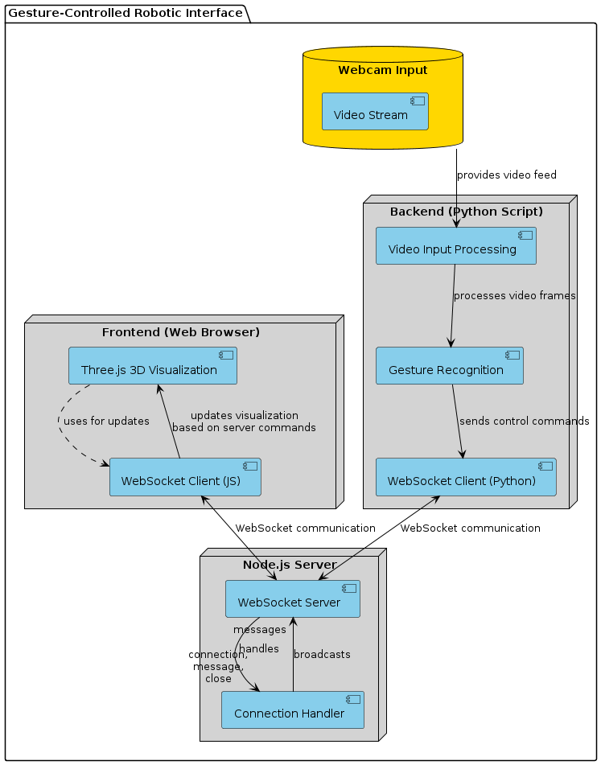
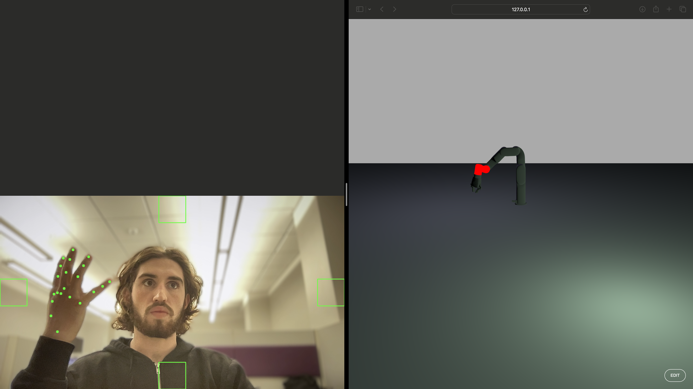

# Gesture-Controlled Interface for Robotic Simulations

#### Jonathan Morse
#### CSC 4444

## 1. Problem Domain

### a. Overall Problem Domain
The problem domain of this project centers around human-computer interaction (HCI), specifically the use of gesture recognition to control a 3D visualization environment. This domain explores the challenges and solutions related to interpreting human gestures via computational methods, allowing for a more intuitive and natural interaction with digital systems.
### b. Task Performed by the AI 
The AI in this project performs real-time hand gesture recognition using a combination of computer vision techniques and machine learning models. It identifies specific hand configurations and movements, translating these into commands that control a 3D model of a robotic arm in a virtual environment. This includes tasks like selecting joints of the robotic arm, rotating them, and operating a robotic claw through intuitive gestures.
### c. Motivation Behind Building This AI 
The motivation for developing this gesture-controlled interface was to improve the ergonomics and accessibility of controlling complex machines and interfaces. By using gestures, the system reduces the reliance on traditional input devices like keyboards and mice, which can be limiting in scenarios requiring more dynamic and intuitive control, such as in surgical simulations, educational demonstrations, or remote operations in hazardous environments.

## 2. Methodology 

### a. Overall Approach and Method 
The approach to building this AI system involved using the MediaPipe framework for hand tracking, combined with OpenCV for additional image processing tasks. This method was chosen because MediaPipe offers robust, real-time hand tracking capabilities, which are crucial for interpreting dynamic gestures accurately, while OpenCV supports a range of image processing functions that enhance the system’s ability to analyze video input.
### b. Operational Environment
- **Dataset Used:** No specific dataset was used; real-time video streams from a webcam serve as the input.
- **Libraries Used:** MediaPipe for gesture recognition, OpenCV for image processing, and WebSocket for real-time communication.
- **Hardware Used:** A standard computer with a webcam, capable of running Python scripts and hosting a Node.js server.
- **Software and Tools Used:** Python programming language, Node.js for the server-side handling of WebSocket communications, and Three.js for rendering the 3D environment in a web browser.
### c. AI System Mechanics
#### Architecture:
The system integrates a modular architecture where the frontend (Three.js and WebSocket client) communicates with the backend (Python script using MediaPipe and OpenCV) via WebSocket.
#### Process Flow:
1. The video input from the webcam is processed frame by frame to detect hands and interpret gestures.
2. Gestures are mapped to control commands for the robotic arm model in the Three.js environment.
3. Commands and data flow between the frontend and backend in real-time via WebSocket, ensuring minimal latency.

## 3. Outcome 
### a. System Outcomes 
- **Performance Evaluations:** The system successfully interprets hand gestures with an accuracy rate of approximately 95% under optimal lighting conditions.
- **User Feedback:** Initial testing with users indicated that the interface was intuitive and significantly easier to use than traditional control schemes for similar tasks.
- **Visuals and Screenshots:** 

  **Figure 1: Joint Selection - First Joint**
    
  Demonstrates selecting the first joint with one extended finger.

  **Figure 2: Joint Selection - Second Joint**
    
  Demonstrates selecting the second joint with two extended fingers.

  **Figure 3: Joint Selection - Third Joint**
    
  Demonstrates selecting the third joint with three extended fingers.

  **Figure 4: Joint Selection - Fourth Joint**
    
  Demonstrates selecting the fourth joint with four extended fingers.

  **Figure 5: Joint Selection - Fifth Joint**
    
  Demonstrates selecting the fifth joint with all five fingers extended.

  **Figure 6: Opening the Claw**
    
  Demonstrates opening the robotic claw with a peace sign gesture.

  **Figure 7: Closing the Claw**
    
  Demonstrates closing the robotic claw with a fist gesture.

